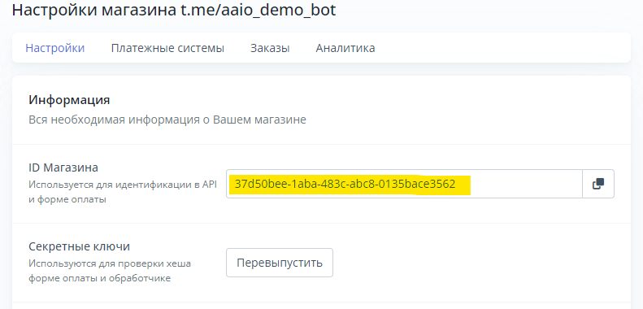

# Начало работы

Для того, чтобы использовать библиотеку, вам понадобится создать клиент библиотеки

```python
import aaio

client = aaio.AAIO(merchant_id, secret_key, api_key)
```

**merchant\_id** - ID вашего магазина, его можно взять вот здесь:

<figure><figcaption><p>Место, где можно взять merchant_id</p></figcaption></figure>

**secret\_key** - секретный ключ **#2**

**api\_key** - API ключ, его можно указать как `''`, если вы не используете общие методы

[https://aaio.so/cabinet/api](https://aaio.so/cabinet/api)

<figure><figcaption></figcaption></figure>
